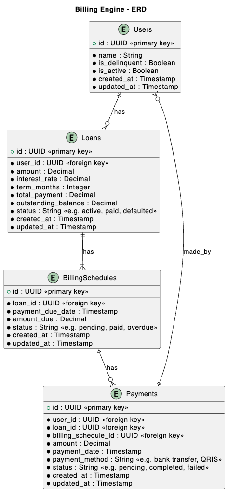

## Problem Statement

A billing system which should be able to provide:
- Loan schedule for a given loan (when client is supposed to pay how much)
- Outstanding Amount for a given loan
- Status of whether the customer is `delinquent` or not

We offer loans to our customers a 50 week loan for Rp 5,000,000/-, and a flat interest rate of 10% per annum. This means that when we create a new loan for the customer(say loan id 100) then it needs to provide the billing schedule for the loan as:

``` W1 : 110000
W2: 110000
W3: 110000
…
W50: 110000
```

The Borrower repays the Amount every week (assume that borrower can only pay the exact amount of payable that week or not pay at all). We need the ability to track the Outstanding balance of the loan (defined as pending amount the borrower needs to pay at any point) eg. at the beginning of the week it is 5,500,000/- and it decreases as the borrower continues to make repayment, at the end of the loan it should be 0/-. 

Some customers may miss repayments, If they miss 2 continuous repayments they are delinquent borrowers. To cover up for missed payments customers will need to make repayments for the remaining amounts. ie if there are 2 pending payments they need to make 2 repayments (of the exact amount). We need to track the borrower if the borrower is `delinquent` (any borrower that who’s not paid for last 2 repayments).

## Functional Requirements

At least the following methods to be implemented:

1. `GetOutstanding`: This returns the current outstanding on a loan, 0 if no outstanding (or closed)

2. `IsDelinquent`: If there are more than 2 weeks of Non payment of the loan amount

3. `MakePayment`: Make a payment of certain amount on the loan

## Non-Functional Requirements

1. Using PostgreSQL to store the data

2. Allow double payment prevention

3. Allow the engine to be accessed either by RESTful API or gRPC


## Designs

### Database



### API

### Protobuff

## Steps

1. Design database diagram

2. Design workflow diagram

3. Create migration script

4. Create method to generate loan

5. Create method to generate billing schedule

6. Create method to check for delinquent

7. Create method to make payment

8. Create method to get outstanding balance

9. Generate billing schedules upon loan generation

10. Upon making payment: 

    - update outstanding amount
    
    - update billing schedule status
    
    - billing overdue has to be paid in full

11. Create scheduler triggered every biling schedule to check for delinquent status

## Test scenarios